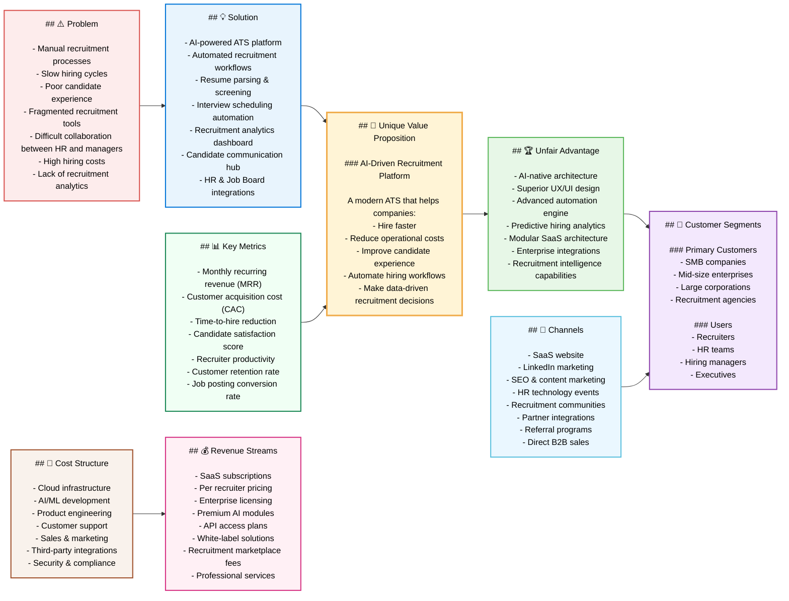
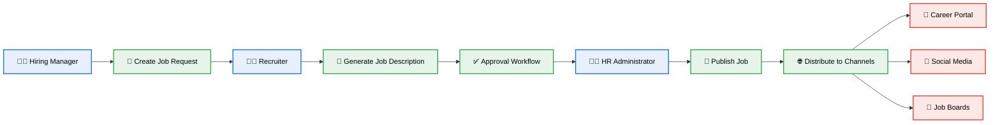
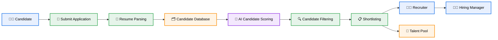
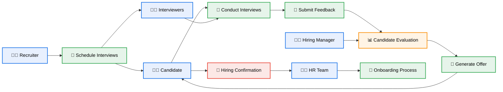
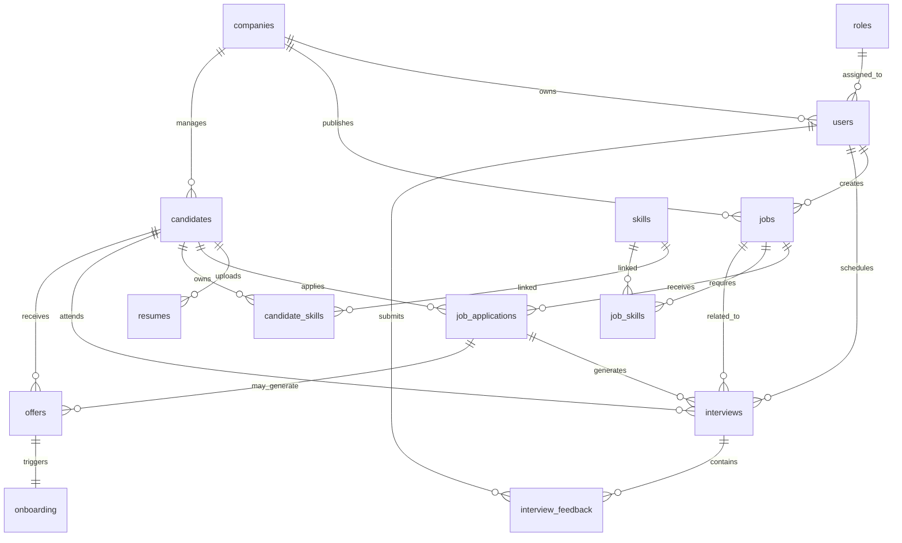
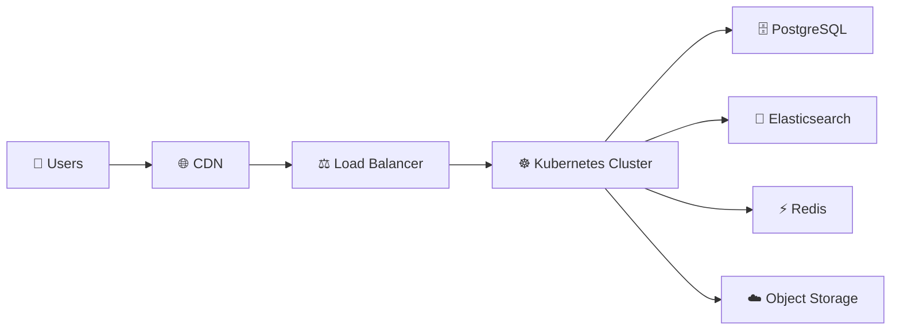

# ARTIFACT 01: Brief description of LTI software, added value and competitive advantages.

# Applicant Tracking System (ATS) - Product Analysis

## 1. Brief Description of an ATS

An Applicant Tracking System (ATS) is a software platform designed to streamline and automate the recruitment and hiring process for organizations.

The primary objective of an ATS is to help Human Resources (HR) teams, recruiters, and hiring managers manage the entire candidate lifecycle, from job requisition creation to onboarding.

An ATS centralizes recruitment activities into a single platform, enabling organizations to:

- Publish job openings across multiple channels
- Collect and organize candidate applications
- Filter and rank resumes
- Manage communication with candidates
- Coordinate interviews
- Track hiring metrics and KPIs
- Maintain compliance and hiring records

Modern ATS platforms often integrate Artificial Intelligence (AI), analytics, workflow automation, and collaboration tools to improve hiring efficiency and candidate experience.

---

# 2. Possible Added Value Features for Our ATS

Below are innovative or differentiated features that could provide additional value compared to traditional ATS platforms in the market.

## AI-Powered Recruitment Features

### AI Resume Screening
- Automatic resume parsing and candidate ranking
- Skill matching against job descriptions
- Identification of high-potential candidates

### AI Candidate Recommendations
- Suggest candidates from internal database
- Similar-profile recommendations
- Predictive hiring success scoring

### AI Interview Assistant
- Suggested interview questions
- Automated interview summaries
- Candidate sentiment analysis

### AI Job Description Generator
- Generate optimized and inclusive job descriptions
- Salary benchmarking suggestions
- Bias detection in job postings

---

## Candidate Experience Improvements

### One-Click Application Process
- Easy application without lengthy forms
- Resume auto-fill capabilities

### Candidate Portal
- Real-time application status tracking
- Interview scheduling visibility
- Personalized communication center

### Mobile-First Experience
- Fully responsive platform
- Recruiter and candidate mobile apps

### Multilingual Support
- Global recruitment support
- Localization by country and region

---

## Advanced Automation

### Automated Workflow Engine
- Configurable recruitment pipelines
- Automated reminders and notifications
- SLA management for recruiters

### Smart Interview Scheduling
- Calendar synchronization
- Automatic time-zone detection
- Video interview integration

### Automated Candidate Nurturing
- Email drip campaigns
- Talent pool engagement
- Recruitment marketing automation

---

## Analytics and Reporting

### Real-Time Hiring Dashboard
- Time-to-hire metrics
- Cost-per-hire analytics
- Funnel conversion tracking

### Predictive Analytics
- Hiring demand forecasting
- Candidate drop-off prediction
- Recruitment performance trends

### Diversity & Inclusion Analytics
- Diversity hiring metrics
- Bias monitoring
- Inclusive recruitment insights

---

## Integration Ecosystem

### HRIS & Payroll Integrations
- Seamless onboarding
- Employee record synchronization

### Third-Party Integrations
- LinkedIn
- Job boards
- Microsoft Teams
- Slack
- Google Workspace
- Zoom

### API-First Architecture
- Custom integrations
- Enterprise extensibility

---

## Security & Compliance

### GDPR / Data Privacy Compliance
- Candidate consent management
- Data retention controls

### Role-Based Access Control
- Granular permissions
- Audit logs

### Compliance Automation
- Hiring documentation tracking
- Equal opportunity reporting

---

# 3. Possible Competitive Advantages

## 3.1 AI-Native Platform

Most ATS systems add AI as an external feature. Building an AI-native ATS from the beginning can become a strong differentiator.

Examples:
- AI-driven recruitment workflows
- Conversational recruiting assistant
- Intelligent candidate scoring

---

## 3.2 Superior User Experience (UX)

Many ATS platforms are considered outdated and difficult to use.

Competitive advantages:
- Modern UI/UX
- Fast navigation
- Minimal learning curve
- Personalized dashboards

---

## 3.3 Faster Recruitment Process

Optimizing operational efficiency can become a key market differentiator.

Potential improvements:
- Reduced manual tasks
- Faster resume processing
- Automated approvals
- Reduced time-to-hire

---

## 3.4 Better Candidate Experience

Many organizations lose candidates due to poor communication.

Differentiators:
- Transparent process tracking
- Faster response times
- Mobile accessibility
- Personalized interactions

---

## 3.5 Data-Driven Hiring

Providing actionable recruitment intelligence could become a strong differentiator.

Capabilities:
- Advanced recruitment analytics
- Predictive hiring insights
- Recruiter productivity measurement

---

## 3.6 SMB-Friendly Pricing

Many ATS platforms are expensive and enterprise-oriented.

Potential advantage:
- Flexible subscription plans
- Modular pricing
- Freemium model
- Pay-per-job-post options

---

## 3.7 Industry-Specific ATS

Specialized ATS solutions can outperform generic competitors.

Examples:
- Healthcare recruiting ATS
- IT recruiting ATS
- Manufacturing hiring ATS
- Executive search ATS

---

## 3.8 Marketplace Ecosystem

Creating an extensible ecosystem can increase product stickiness.

Examples:
- Integration marketplace
- Plugin architecture
- Third-party extensions

---

# 4. Possible Benefits of Using an ATS

## Recruitment Efficiency
- Reduced manual recruitment work
- Faster candidate processing
- Streamlined hiring workflows

## Improved Hiring Quality
- Better candidate-job matching
- Standardized evaluations
- Data-supported decisions

## Centralized Candidate Database
- Single source of truth for applicants
- Easier candidate retrieval
- Talent pool management

## Better Team Collaboration
- Shared hiring feedback
- Centralized communication
- Improved hiring transparency

## Reduced Hiring Costs
- Lower operational costs
- Reduced dependency on external agencies
- Faster vacancy fulfillment

## Better Candidate Experience
- Faster communication
- Transparent hiring process
- Simplified application experience

## Recruitment Analytics
- Better visibility into recruitment performance
- KPI tracking
- Process optimization opportunities

## Compliance and Auditability
- Secure record management
- Hiring compliance support
- Audit-ready documentation

## Scalability
- Ability to manage large hiring volumes
- Multi-location recruitment support
- Global hiring processes

---

# 5. Normal ATS Workflow (Actors & Users)

## Main Actors Involved

| Actor | Responsibilities |
|---|---|
| Candidate | Applies for jobs and participates in hiring process |
| Recruiter | Manages recruitment process and candidate screening |
| Hiring Manager | Evaluates candidates and makes hiring decisions |
| HR Administrator | Oversees ATS configuration and compliance |
| Interviewers | Conduct technical or behavioral interviews |
| Executives / Leadership | Monitor hiring KPIs and workforce planning |
| System Administrator | Maintains platform configurations and integrations |

---

# Standard ATS Workflow

## 1. Job Requisition Creation

### Actors
- Hiring Manager
- Recruiter
- HR

### Activities
- Request new position
- Define budget and headcount
- Create job description
- Approval workflow

### ATS Features
- Job templates
- Approval automation
- AI-generated job descriptions

---

## 2. Job Posting & Distribution

### Actors
- Recruiter

### Activities
- Publish vacancies
- Share on job boards and social media

### ATS Features
- Multi-channel posting
- Recruitment marketing
- Employer branding tools

---

## 3. Candidate Application

### Actors
- Candidate

### Activities
- Submit application
- Upload resume
- Complete questionnaires

### ATS Features
- Mobile application
- Resume parsing
- One-click apply

---

## 4. Resume Screening & Filtering

### Actors
- Recruiter
- ATS AI Engine

### Activities
- Resume review
- Skill matching
- Candidate ranking

### ATS Features
- AI screening
- Knockout questions
- Automated scoring

---

## 5. Recruiter Review

### Actors
- Recruiter

### Activities
- Shortlist candidates
- Contact applicants
- Schedule interviews

### ATS Features
- Communication templates
- Candidate pipelines
- Automated workflows

---

## 6. Interview Process

### Actors
- Recruiter
- Hiring Manager
- Interviewers
- Candidate

### Activities
- Technical interviews
- Behavioral interviews
- Assessments

### ATS Features
- Interview scheduling
- Video interview integration
- Feedback forms

---

## 7. Candidate Evaluation

### Actors
- Hiring Manager
- Interviewers
- Recruiter

### Activities
- Submit feedback
- Compare candidates
- Final recommendation

### ATS Features
- Scorecards
- Collaboration tools
- Decision tracking

---

## 8. Offer Management

### Actors
- Recruiter
- HR
- Candidate

### Activities
- Generate offer letter
- Salary negotiation
- Offer acceptance

### ATS Features
- Offer templates
- Digital signatures
- Compensation workflows

---

## 9. Hiring & Onboarding

### Actors
- HR
- Candidate
- IT
- Payroll

### Activities
- Employee onboarding
- Document collection
- System provisioning

### ATS Features
- HRIS integration
- Onboarding workflows
- Compliance management

---

## 10. Analytics & Reporting

### Actors
- HR Leadership
- Executives
- Recruiters

### Activities
- Review hiring metrics
- Optimize recruitment process
- Workforce planning

### ATS Features
- Dashboards
- KPI reporting
- Predictive analytics

---

# Example ATS End-to-End Flow Diagram

```text
Hiring Request
      ↓
Job Approval
      ↓
Job Posting
      ↓
Candidate Applications
      ↓
Resume Parsing & Screening
      ↓
Recruiter Review
      ↓
Interviews
      ↓
Candidate Evaluation
      ↓
Offer Letter
      ↓
Hiring Decision
      ↓
Onboarding
      ↓
Analytics & Reporting

```


# ARTIFACT 02: Explanation of the main functions.

# Main Functions of an Applicant Tracking System (ATS)

## Introduction

An Applicant Tracking System (ATS) is designed to automate, centralize, and optimize the complete recruitment lifecycle. Based on the previous analysis and the workflow illustrated in the attached image, the ATS can be understood as a sequence of interconnected modules that help organizations attract, evaluate, hire, and onboard talent efficiently.

The image represents a simplified ATS hiring cycle where each stage corresponds to a core functional area of the system.

---

# ATS Main Functional Modules

## 1. Creating Jobs

### Purpose
This function allows recruiters and hiring managers to create and configure new job openings inside the ATS.

### Main Capabilities
- Job requisition creation
- Job title and description management
- Department and location assignment
- Salary range definition
- Employment type configuration
- Approval workflows
- Hiring budget tracking

### Advanced Features
- AI-generated job descriptions
- Inclusive language recommendations
- Job templates
- Skill and competency libraries

### Actors Involved
- Hiring Managers
- Recruiters
- HR Administrators

### Business Value
- Standardizes job creation
- Reduces manual effort
- Accelerates recruitment initiation
- Ensures organizational compliance

---

# 2. Jobs Published on Job Boards, Website, Social Media, etc.

### Purpose
This module distributes job openings across multiple recruitment channels.

### Main Capabilities
- Multi-channel job publishing
- Career site integration
- Social media posting
- Job board integrations
- Referral program management

### Supported Channels
- Company career website
- LinkedIn
- Indeed
- Glassdoor
- Social media platforms
- University portals
- Internal mobility portals

### Advanced Features
- Programmatic advertising
- Recruitment marketing campaigns
- SEO optimization for job posts
- Automated reposting

### Actors Involved
- Recruiters
- Talent Acquisition Teams
- Marketing Teams

### Business Value
- Expands candidate reach
- Improves employer branding
- Increases application volume
- Reduces recruitment marketing effort

---

# 3. Job Applications Received

### Purpose
This function centralizes all candidate applications into a single database.

### Main Capabilities
- Application collection
- Resume uploads
- Candidate profile creation
- Candidate database management
- Application tracking

### Advanced Features
- Resume parsing
- Auto-fill forms
- Candidate tagging
- Duplicate candidate detection
- Talent pool creation

### Candidate Information Typically Captured
- Resume/CV
- Contact details
- Work experience
- Education
- Skills
- Certifications
- Portfolio links

### Actors Involved
- Candidates
- Recruiters

### Business Value
- Centralized candidate management
- Easier candidate searchability
- Improved organization of applicants

---

# 4. Applications are Reviewed

### Purpose
Recruiters evaluate and shortlist applicants according to job requirements.

### Main Capabilities
- Resume screening
- Candidate filtering
- Skill matching
- Candidate ranking
- Shortlisting

### Common Filtering Criteria
- Skills
- Experience
- Education
- Location
- Salary expectations
- Certifications

### Advanced AI Features
- AI-powered candidate scoring
- Predictive hiring recommendations
- Bias reduction mechanisms
- Semantic resume analysis

### Actors Involved
- Recruiters
- Hiring Managers

### Business Value
- Reduces manual screening effort
- Improves hiring quality
- Accelerates candidate selection

---

# 5. Online Tests are Conducted

### Purpose
Candidates complete evaluations that validate technical, cognitive, or behavioral competencies.

### Main Capabilities
- Technical assessments
- Coding tests
- Aptitude tests
- Personality assessments
- Language proficiency tests

### Advanced Features
- Automated grading
- Proctoring systems
- AI-based cheating detection
- Custom assessment workflows

### Integration Possibilities
- HackerRank
- Codility
- TestGorilla
- Mercer Mettl

### Actors Involved
- Candidates
- Recruiters
- Technical Evaluators

### Business Value
- Objective candidate evaluation
- Better skill validation
- Reduced hiring risks

---

# 6. Interviews are Scheduled

### Purpose
Coordinate interviews between candidates and interviewers.

### Main Capabilities
- Interview scheduling
- Calendar synchronization
- Video interview integration
- Interview reminders
- Panel coordination

### Advanced Features
- AI scheduling assistant
- Automatic timezone handling
- Self-service interview booking
- Interview workflow automation

### Integrated Platforms
- Google Meet
- Microsoft Teams
- Zoom

### Actors Involved
- Recruiters
- Hiring Managers
- Interviewers
- Candidates

### Business Value
- Reduces coordination effort
- Improves candidate experience
- Accelerates recruitment timelines

---

# 7. Selected Applicants are Hired

### Purpose
Finalize the hiring process and convert candidates into employees.

### Main Capabilities
- Offer management
- Compensation approval
- Offer letter generation
- Digital signatures
- Hiring confirmation

### Advanced Features
- Automated onboarding initiation
- HRIS integration
- Background check integration
- Compliance verification

### Actors Involved
- HR Teams
- Recruiters
- Hiring Managers
- Payroll Teams
- IT Teams

### Business Value
- Faster hiring completion
- Reduced onboarding delays
- Better operational coordination

---

# Additional Important ATS Functions

Although not represented directly in the image, modern ATS platforms usually include additional strategic modules.

---

# 8. Candidate Communication Management

### Features
- Automated emails
- SMS notifications
- Candidate chat systems
- Interview reminders
- Application status updates

### Benefits
- Better candidate engagement
- Reduced communication delays
- Improved employer branding

---

# 9. Analytics and Reporting

### Features
- Recruitment dashboards
- KPI monitoring
- Funnel analytics
- Time-to-hire metrics
- Cost-per-hire analysis

### Benefits
- Data-driven hiring decisions
- Process optimization
- Recruiter performance tracking

---

# 10. Talent Pool & CRM Functionality

### Features
- Passive candidate management
- Candidate relationship management
- Talent pipeline nurturing
- Recruitment campaigns

### Benefits
- Faster future hiring
- Reduced sourcing costs
- Long-term talent engagement

---

# 11. Workflow Automation

### Features
- Automated status changes
- Trigger-based notifications
- Approval workflows
- Recruitment SLA monitoring

### Benefits
- Operational efficiency
- Reduced manual work
- Standardized hiring processes

---

# 12. Security and Compliance

### Features
- GDPR compliance
- Role-based access control
- Audit logs
- Consent management
- Data retention policies

### Benefits
- Legal compliance
- Data protection
- Secure recruitment operations

---

# AI Capabilities That Modern ATS Systems Should Include

## AI Resume Parsing
Extract structured data automatically from resumes.

## AI Candidate Matching
Match candidates against job requirements intelligently.

## AI Chatbots
Answer candidate questions automatically.

## Predictive Hiring Analytics
Estimate hiring success probabilities.

## AI Interview Assistance
Generate interview questions and summaries.

## AI Recruitment Insights
Identify bottlenecks and optimization opportunities.

---

# End-to-End ATS Workflow Overview

```text
1. Job Creation
        ↓
2. Job Publishing
        ↓
3. Candidate Applications
        ↓
4. Resume Screening
        ↓
5. Online Assessments
        ↓
6. Interview Scheduling
        ↓
7. Candidate Evaluation
        ↓
8. Offer Management
        ↓
9. Hiring & Onboarding
        ↓
10. Reporting & Analytics

```


# ARTIFACT 03: Add a Lean Canvas diagram to understand the business model.

# ATS (Applicant Tracking System) - Lean Canvas Business Model

## Introduction

The following Lean Canvas represents the business model for a modern AI-powered Applicant Tracking System (ATS) based on the previous product analysis.

The objective of this Lean Canvas is to provide a clear strategic visualization of:
- The market opportunity
- Customer problems
- Proposed solution
- Competitive advantages
- Revenue opportunities
- Key business metrics

The diagram below is fully compatible with Markdown environments that support Mermaid diagrams (GitHub, GitLab, Obsidian, Notion with Mermaid support, Azure DevOps, etc.).

---

# ATS Lean Canvas Diagram




# ARTIFACT 04: Description of the 3 main use cases, with the diagram associated with each one.

# ATS (Applicant Tracking System)
# Main Use Cases and Workflow Analysis

---

# Table of Contents

1. Introduction
2. Use Case 1 - Job Creation and Publishing
3. Use Case 2 - Candidate Application and Screening
4. Use Case 3 - Interview Management and Hiring
5. Complete ATS Workflow
6. Key Benefits
7. Strategic Considerations
8. Final Conclusion

---

# 1. Introduction

An Applicant Tracking System (ATS) is a software platform designed to automate, centralize, and optimize recruitment and hiring processes.

Modern ATS platforms are no longer limited to applicant storage. They now include:
- Artificial Intelligence (AI)
- Workflow automation
- Recruitment analytics
- Candidate relationship management
- Collaboration tools
- Enterprise integrations

The purpose of this document is to describe the 3 most important ATS use cases that form the foundation of the recruitment lifecycle.

These use cases cover:
1. Job creation and publishing
2. Candidate application and screening
3. Interview management and hiring

Each use case contains:
- Objectives
- Main actors
- Functional description
- Main features
- Business value
- Visual workflow diagram

All diagrams are fully compatible with Mermaid Markdown rendering engines.


# 2. Use Case 1 - Job Creation and Publishing

## Objective

Allow recruiters and hiring managers to create, approve, and publish job vacancies efficiently across multiple recruitment channels.

## Main Actors

| Actor | Responsibility |
|---|---|
| Hiring Manager | Requests new hiring position |
| Recruiter | Creates and publishes jobs |
| HR Administrator | Reviews and approves hiring requests |
| ATS Platform | Automates workflows and distribution |

## Functional Description

This use case represents the first stage of the recruitment process.

The ATS centralizes:
- Job requisition creation
- Approval workflows
- Job publishing
- Distribution to external recruitment channels

The objective is to reduce manual work and accelerate the hiring process.

## Main Features

### Recruitment Management
- Job requisition creation
- Department assignment
- Salary range management
- Hiring approvals

### AI Features
- AI-generated job descriptions
- Skill recommendations
- Inclusive language suggestions

### Publishing Features
- Multi-channel publishing
- Job board integrations
- Social media publishing
- Career portal integration

## Business Value

### Operational Benefits
- Faster recruitment startup
- Reduced administrative effort
- Standardized job creation process

### Strategic Benefits
- Better employer branding
- Increased candidate reach
- Improved recruitment scalability

## Use Case 1 Workflow Diagram




# 3. Use Case 2 - Candidate Application and Screening

## Objective

Allow candidates to apply for jobs while enabling recruiters and AI systems to evaluate and shortlist candidates efficiently.

## Main Actors

| Actor | Responsibility |
|---|---|
| Candidate | Applies to vacancies |
| Recruiter | Reviews and filters applications |
| ATS AI Engine | Parses and scores resumes |
| Hiring Manager | Reviews shortlisted candidates |

## Functional Description

This use case manages the candidate intake and screening process.

The ATS automates:
- Application collection
- Resume parsing
- Candidate scoring
- Candidate filtering
- Shortlisting workflows

The platform centralizes all candidate information into a searchable database.

## Main Features

### Candidate Management
- Candidate portal
- Resume uploads
- Candidate profiles
- Talent pools

### AI Features
- Resume parsing
- AI candidate scoring
- Skill matching
- Candidate ranking

### Recruiter Features
- Advanced filtering
- Candidate tagging
- Collaboration tools
- Automated notifications

## Business Value

### Operational Benefits
- Reduced manual screening effort
- Faster candidate evaluation
- Improved recruiter productivity

### Strategic Benefits
- Better hiring quality
- Centralized talent intelligence
- Improved candidate organization

## Use Case 2 Workflow Diagram



---

# 4. Use Case 3 - Interview Management and Hiring

## Objective

Coordinate interviews, evaluations, offer management, and candidate hiring in a centralized recruitment workflow.

## Main Actors

| Actor | Responsibility |
|---|---|
| Recruiter | Coordinates interviews |
| Interviewers | Evaluate candidates |
| Hiring Manager | Makes hiring decisions |
| Candidate | Participates in interviews |
| HR Team | Finalizes onboarding |

## Functional Description

This use case manages the final recruitment stages where shortlisted candidates move through interviews, evaluations, and hiring approval.

The ATS automates:
- Interview scheduling
- Candidate communication
- Interview evaluations
- Offer management
- Hiring confirmation
- Onboarding initiation

## Main Features

### Interview Management
- Calendar synchronization
- Video interview integration
- Interview reminders
- Interview scorecards

### Hiring Management
- Offer generation
- Digital signatures
- Compensation approvals
- Hiring workflows

### Onboarding Features
- HRIS integration
- Employee onboarding
- Compliance documentation

## Business Value

### Operational Benefits
- Faster hiring decisions
- Reduced scheduling effort
- Improved collaboration

### Strategic Benefits
- Better candidate experience
- Improved hiring consistency
- Reduced time-to-hire

## Use Case 3 Workflow Diagram



---

# 5. Complete ATS Workflow

```mermaid
flowchart LR

A["📝 Job Creation"]
B["📢 Job Publishing"]
C["📨 Candidate Applications"]
D["🤖 Resume Screening"]
E["📋 Candidate Shortlisting"]
F["📅 Interview Scheduling"]
G["🎥 Interviews"]
H["📊 Candidate Evaluation"]
I["📄 Offer Management"]
J["🤝 Hiring"]
K["🚀 Onboarding"]

A --> B
B --> C
C --> D
D --> E
E --> F
F --> G
G --> H
H --> I
I --> J
J --> K
```



---

# 6. Key Benefits

| Category | Benefits |
|---|---|
| Recruitment Efficiency | Faster hiring workflows |
| Automation | Reduced manual work |
| Candidate Experience | Better communication and transparency |
| Hiring Quality | Improved candidate-job matching |
| Collaboration | Centralized evaluations and feedback |
| Analytics | Better recruitment visibility |
| Scalability | Support for high hiring volumes |
| Compliance | Standardized recruitment operations |

---

# 7. Strategic Considerations

## Recommended Product Vision

Transform the ATS from a traditional applicant database into an AI-powered recruitment intelligence platform.

## Recommended Competitive Advantages

### AI-Driven Automation
- Resume scoring
- Candidate recommendations
- Predictive hiring analytics

### Excellent User Experience
- Simple recruiter workflows
- Modern UI/UX
- Mobile-first experience

### Enterprise Integration
- HRIS systems
- Job boards
- Calendar platforms
- Video interview systems

### Recruitment Analytics
- Time-to-hire tracking
- Recruiter productivity
- Funnel conversion analysis

---

# 8. Final Conclusion

The 3 primary ATS use cases form the operational foundation of modern recruitment systems:

1. Job Creation & Publishing
2. Candidate Application & Screening
3. Interview Management & Hiring

Together these workflows enable organizations to:
- Attract candidates efficiently
- Evaluate talent intelligently
- Accelerate hiring decisions
- Improve recruitment scalability

A successful ATS platform should focus on:
- AI-powered automation
- Candidate experience
- Workflow optimization
- Recruitment analytics
- Enterprise integrations

These capabilities transform recruitment into a scalable, intelligent, and strategic business process.


# ARTIFACT 5: Data model that covers entities, attributes (name and type) and relationships.

# ATS (Applicant Tracking System)
# Database Design and Data Model Analysis

---

# Table of Contents

1. Introduction
2. Database Design Principles
3. High-Level Architecture
4. Core Entities Overview
5. ER Diagram
6. Detailed Entity Definitions
7. Relationships
8. Indexing Strategy
9. Recommended Constraints
10. Audit & Security Considerations
11. Scalability Recommendations
12. Future Enhancements
13. Final Conclusion

---

# 1. Introduction

This document presents a complete relational database design for a modern AI-powered Applicant Tracking System (ATS).

The proposed model is designed to support:

- Recruitment workflows
- Candidate management
- Job posting management
- Interview coordination
- Offer management
- Hiring and onboarding
- Analytics and reporting
- AI-driven recruitment capabilities

The model follows enterprise-grade database design principles and is optimized for:
- Scalability
- Performance
- Security
- Maintainability
- Analytics
- Multi-tenant SaaS readiness

---

# 2. Database Design Principles

| Principle | Description |
|---|---|
| Normalization | Avoid data duplication |
| Scalability | Support large recruitment volumes |
| Flexibility | Enable configurable workflows |
| Auditability | Track recruitment changes |
| Security | Protect candidate data |
| Performance | Optimize searches and filtering |
| Extensibility | Support future ATS modules |

---

# 3. High-Level Architecture

| Domain | Purpose |
|---|---|
| Identity & Access | Users, roles, permissions |
| Recruitment | Jobs, applications, workflows |
| Candidate Management | Candidate profiles and resumes |
| Interview Management | Interviews and evaluations |
| Hiring | Offers and onboarding |
| Communication | Emails and notifications |
| Analytics | Metrics and reports |
| AI Services | Candidate scoring and recommendations |

---

# 4. Core Entities Overview

| Entity | Description |
|---|---|
| companies | Tenant organizations |
| users | Recruiters, HR, managers |
| roles | Access control roles |
| candidates | Candidate profiles |
| resumes | Uploaded resumes |
| jobs | Job openings |
| job_applications | Candidate applications |
| interviews | Interview scheduling |
| interview_feedback | Evaluation results |
| offers | Offer management |
| onboarding | Employee onboarding |
| skills | Skill catalog |
| candidate_skills | Candidate skills |
| job_skills | Required job skills |
| notifications | System notifications |
| activity_logs | Audit and activity tracking |

---

# 5. ATS Entity Relationship Diagram (ERD)



---

# 6. Detailed Entity Definitions

## companies

| Attribute | Type |
|---|---|
| id | BIGINT PK |
| name | VARCHAR(255) |
| domain | VARCHAR(255) |
| industry | VARCHAR(100) |
| company_size | VARCHAR(50) |
| created_at | TIMESTAMP |
| updated_at | TIMESTAMP |

### Indexes

```sql
CREATE UNIQUE INDEX idx_companies_domain
ON companies(domain);
```

---

## users

| Attribute | Type |
|---|---|
| id | BIGINT PK |
| company_id | BIGINT FK |
| role_id | BIGINT FK |
| first_name | VARCHAR(100) |
| last_name | VARCHAR(100) |
| email | VARCHAR(255) |
| password_hash | VARCHAR(255) |
| status | VARCHAR(50) |
| created_at | TIMESTAMP |

### Indexes

```sql
CREATE UNIQUE INDEX idx_users_email
ON users(email);

CREATE INDEX idx_users_company
ON users(company_id);
```

---

## candidates

| Attribute | Type |
|---|---|
| id | BIGINT PK |
| company_id | BIGINT FK |
| first_name | VARCHAR(100) |
| last_name | VARCHAR(100) |
| email | VARCHAR(255) |
| phone | VARCHAR(50) |
| linkedin_url | VARCHAR(500) |
| current_position | VARCHAR(255) |
| years_experience | INTEGER |
| location | VARCHAR(255) |
| source | VARCHAR(100) |
| status | VARCHAR(50) |
| created_at | TIMESTAMP |

### Indexes

```sql
CREATE UNIQUE INDEX idx_candidates_email
ON candidates(email);

CREATE INDEX idx_candidates_status
ON candidates(status);
```

---

## jobs

| Attribute | Type |
|---|---|
| id | BIGINT PK |
| company_id | BIGINT FK |
| created_by_user_id | BIGINT FK |
| title | VARCHAR(255) |
| description | TEXT |
| department | VARCHAR(100) |
| employment_type | VARCHAR(50) |
| location | VARCHAR(255) |
| salary_min | DECIMAL(12,2) |
| salary_max | DECIMAL(12,2) |
| status | VARCHAR(50) |
| published_at | TIMESTAMP |
| created_at | TIMESTAMP |

### Indexes

```sql
CREATE INDEX idx_jobs_company
ON jobs(company_id);

CREATE INDEX idx_jobs_status
ON jobs(status);

CREATE FULLTEXT INDEX idx_jobs_title_description
ON jobs(title, description);
```

---

## job_applications

| Attribute | Type |
|---|---|
| id | BIGINT PK |
| candidate_id | BIGINT FK |
| job_id | BIGINT FK |
| application_source | VARCHAR(100) |
| current_stage | VARCHAR(100) |
| ai_score | DECIMAL(5,2) |
| recruiter_rating | DECIMAL(5,2) |
| applied_at | TIMESTAMP |

### Indexes

```sql
CREATE INDEX idx_applications_candidate
ON job_applications(candidate_id);

CREATE INDEX idx_applications_job
ON job_applications(job_id);

CREATE INDEX idx_applications_stage
ON job_applications(current_stage);
```

---

## interviews

| Attribute | Type |
|---|---|
| id | BIGINT PK |
| application_id | BIGINT FK |
| candidate_id | BIGINT FK |
| interviewer_user_id | BIGINT FK |
| interview_type | VARCHAR(50) |
| scheduled_at | TIMESTAMP |
| duration_minutes | INTEGER |
| meeting_url | VARCHAR(1000) |
| status | VARCHAR(50) |

### Indexes

```sql
CREATE INDEX idx_interviews_candidate
ON interviews(candidate_id);

CREATE INDEX idx_interviews_schedule
ON interviews(scheduled_at);
```

---

## offers

| Attribute | Type |
|---|---|
| id | BIGINT PK |
| application_id | BIGINT FK |
| candidate_id | BIGINT FK |
| salary_offer | DECIMAL(12,2) |
| currency | VARCHAR(10) |
| offer_status | VARCHAR(50) |
| issued_at | TIMESTAMP |
| accepted_at | TIMESTAMP |

---

# 7. Relationships Summary

| Relationship | Type |
|---|---|
| Company → Users | One-to-Many |
| Company → Jobs | One-to-Many |
| Candidate → Applications | One-to-Many |
| Job → Applications | One-to-Many |
| Candidate ↔ Skills | Many-to-Many |
| Job ↔ Skills | Many-to-Many |
| Application → Interviews | One-to-Many |
| Interview → Feedback | One-to-Many |
| Offer → Onboarding | One-to-One |

---

# 8. Indexing Strategy

| Index Type | Usage |
|---|---|
| B-Tree | Standard filtering |
| Full-Text | Resume and job searches |
| Composite Index | Multi-column filters |
| Partial Index | Status-based filtering |
| JSON Index | AI metadata queries |

---

# 9. Recommended Constraints

```sql
ALTER TABLE jobs
ADD CONSTRAINT chk_salary
CHECK (salary_min <= salary_max);
```

```sql
ALTER TABLE candidates
ADD CONSTRAINT uq_candidate_email
UNIQUE(email);
```

---

# 10. Audit & Security Considerations

## Recommended Security Features

- Password hashing (bcrypt/argon2)
- Role-based access control (RBAC)
- Data encryption at rest
- PII masking
- GDPR compliance
- Audit trails

---

# 11. Scalability Recommendations

| Layer | Recommendation |
|---|---|
| Primary Database | PostgreSQL |
| Search Engine | Elasticsearch |
| Cache | Redis |
| File Storage | S3-compatible object storage |
| Analytics | Data warehouse |

---

# 12. Future Enhancements

## AI Extensions

Additional AI tables can support:
- Candidate embeddings
- Semantic matching
- AI recommendations
- Interview transcription analysis

---

# 13. Final Conclusion

This ATS data model provides a scalable and enterprise-ready foundation for modern recruitment systems.

The proposed schema is optimized for:
- Performance
- Extensibility
- Security
- High-volume recruitment operations

This architecture enables the ATS platform to evolve into a full recruitment intelligence ecosystem capable of supporting modern AI-driven hiring workflows.


# ARTIFACT 5: High-level system design, both explained and with an attached diagram.

# ATS (Applicant Tracking System)
# High-Level System Design (HLD)

---

# Table of Contents

1. Introduction
2. System Objectives
3. Architectural Principles
4. High-Level Architecture Overview
5. System Components
6. High-Level Architecture Diagram
7. Frontend Layer
8. Backend Services Layer
9. AI & Intelligence Layer
10. Data Layer
11. Infrastructure Layer
12. Security Architecture
13. Scalability Strategy
14. Integration Architecture
15. Deployment Architecture
16. Non-Functional Requirements
17. Technology Recommendations
18. Final Conclusion

---

# 1. Introduction

This document presents the High-Level System Design (HLD) for a modern AI-powered Applicant Tracking System (ATS).

The architecture is designed to support:
- Enterprise recruitment workflows
- Multi-tenant SaaS architecture
- AI-powered candidate matching
- High scalability
- Real-time collaboration
- Workflow automation
- Analytics and reporting
- External platform integrations

The proposed system is cloud-native, modular, scalable, secure, and optimized for future AI capabilities.

---

# 2. System Objectives

The ATS platform should provide:

| Objective | Description |
|---|---|
| Scalability | Handle large recruitment volumes |
| Availability | High uptime and fault tolerance |
| Security | Protect sensitive candidate data |
| Performance | Fast candidate/job search |
| Extensibility | Enable future modules and AI services |
| Multi-Tenancy | Support multiple organizations |
| Automation | Reduce manual recruitment work |
| Integration | Connect with external HR systems |

---

# 3. Architectural Principles

The proposed architecture follows these principles:

- Microservices-oriented architecture
- API-first design
- Event-driven communication
- Cloud-native infrastructure
- Stateless services
- Domain-driven modularization
- Security by design
- Observability and monitoring

---

# 4. High-Level Architecture Overview

The ATS system is divided into the following logical layers:

| Layer | Purpose |
|---|---|
| Presentation Layer | Web and mobile applications |
| API Gateway Layer | Centralized API routing |
| Application Services Layer | Business logic services |
| AI Services Layer | Intelligent automation |
| Data Layer | Relational and search databases |
| Infrastructure Layer | Cloud infrastructure and DevOps |
| Integration Layer | External systems connectivity |

---

# 5. System Components

## Frontend Components

- Recruiter Web Portal
- Candidate Portal
- Hiring Manager Dashboard
- Mobile Responsive UI
- Admin Console

## Backend Services

- Authentication Service
- User Management Service
- Candidate Service
- Job Management Service
- Application Service
- Interview Service
- Notification Service
- Reporting Service
- Workflow Engine

## AI Services

- Resume Parsing
- AI Candidate Scoring
- Semantic Skill Matching
- AI Recommendations
- Predictive Analytics

## Data Components

- PostgreSQL
- Elasticsearch
- Redis Cache
- Object Storage
- Analytics Warehouse

---

# 6. High-Level Architecture Diagram

```mermaid
flowchart TB

%% ====================================================
%% STYLES
%% ====================================================

classDef frontend fill:#E8F0FE,stroke:#1A73E8,color:#000,stroke-width:2px;
classDef gateway fill:#FFF4E5,stroke:#FB8C00,color:#000,stroke-width:2px;
classDef backend fill:#E6F4EA,stroke:#34A853,color:#000,stroke-width:2px;
classDef ai fill:#F3E8FD,stroke:#9334E6,color:#000,stroke-width:2px;
classDef data fill:#FCE8E6,stroke:#EA4335,color:#000,stroke-width:2px;
classDef infra fill:#ECEFF1,stroke:#607D8B,color:#000,stroke-width:2px;

%% ====================================================
%% FRONTEND
%% ====================================================

Recruiter["🧑‍💼 Recruiter Portal"]
Candidate["👨‍💻 Candidate Portal"]
Manager["👨‍⚖️ Hiring Manager Portal"]
Admin["⚙️ Admin Console"]

%% ====================================================
%% API GATEWAY
%% ====================================================

Gateway["🌐 API Gateway"]

%% ====================================================
%% BACKEND SERVICES
%% ====================================================

Auth["🔐 Auth Service"]
User["👥 User Service"]
Job["📄 Job Service"]
CandidateSvc["🧾 Candidate Service"]
Application["📨 Application Service"]
Interview["🎥 Interview Service"]
Notification["🔔 Notification Service"]
Workflow["⚙️ Workflow Engine"]
Reporting["📊 Reporting Service"]

%% ====================================================
%% AI SERVICES
%% ====================================================

ResumeAI["🤖 Resume Parsing AI"]
MatchingAI["🧠 Candidate Matching AI"]
AnalyticsAI["📈 Predictive Analytics AI"]

%% ====================================================
%% DATA LAYER
%% ====================================================

Postgres["🗄️ PostgreSQL"]
Elastic["🔎 Elasticsearch"]
Redis["⚡ Redis Cache"]
Storage["☁️ Object Storage"]
Warehouse["📊 Analytics Warehouse"]

%% ====================================================
%% INFRASTRUCTURE
%% ====================================================

K8s["☸️ Kubernetes"]
Monitoring["📡 Monitoring & Logging"]
CI["🚀 CI/CD Pipeline"]

%% ====================================================
%% FLOW
%% ====================================================

Recruiter --> Gateway
Candidate --> Gateway
Manager --> Gateway
Admin --> Gateway

Gateway --> Auth
Gateway --> User
Gateway --> Job
Gateway --> CandidateSvc
Gateway --> Application
Gateway --> Interview
Gateway --> Notification
Gateway --> Workflow
Gateway --> Reporting

Application --> ResumeAI
CandidateSvc --> MatchingAI
Reporting --> AnalyticsAI

Auth --> Postgres
User --> Postgres
Job --> Postgres
CandidateSvc --> Postgres
Application --> Postgres
Interview --> Postgres

CandidateSvc --> Elastic
Job --> Elastic

Application --> Redis

ResumeAI --> Storage

Reporting --> Warehouse

K8s --> Gateway
K8s --> Auth
K8s --> User
K8s --> Job
K8s --> CandidateSvc
K8s --> Application
K8s --> Interview

Monitoring --> K8s
CI --> K8s

%% ====================================================
%% CLASSES
%% ====================================================

class Recruiter,Candidate,Manager,Admin frontend;
class Gateway gateway;
class Auth,User,Job,CandidateSvc,Application,Interview,Notification,Workflow,Reporting backend;
class ResumeAI,MatchingAI,AnalyticsAI ai;
class Postgres,Elastic,Redis,Storage,Warehouse data;
class K8s,Monitoring,CI infra;
```



---

# 7. Frontend Layer

The frontend layer provides interfaces for all system actors.

## Main Applications

| Application | Users |
|---|---|
| Recruiter Portal | Recruiters |
| Candidate Portal | Candidates |
| Hiring Dashboard | Hiring Managers |
| Admin Console | System Administrators |

## Responsibilities

- Authentication
- Job management
- Candidate tracking
- Interview scheduling
- Reporting dashboards
- Workflow management

## Recommended Technologies

- React.js / Next.js
- TypeScript
- Tailwind CSS
- GraphQL / REST APIs

---

# 8. Backend Services Layer

The backend follows a modular microservices architecture.

## Core Services

| Service | Responsibility |
|---|---|
| Auth Service | Authentication and authorization |
| User Service | User management |
| Job Service | Job lifecycle management |
| Candidate Service | Candidate profiles |
| Application Service | Recruitment workflows |
| Interview Service | Interview scheduling |
| Notification Service | Email/SMS notifications |
| Reporting Service | Metrics and analytics |

## Benefits

- Independent scalability
- Fault isolation
- Faster deployments
- Team autonomy

---

# 9. AI & Intelligence Layer

The AI layer enhances recruitment automation.

## AI Components

### Resume Parsing AI
Extracts:
- Skills
- Experience
- Education
- Certifications

### Candidate Matching AI
Performs:
- Semantic matching
- Job-fit scoring
- Ranking recommendations

### Predictive Analytics
Provides:
- Hiring forecasts
- Funnel analytics
- Recruitment insights

## Recommended Technologies

- Python
- FastAPI
- TensorFlow / PyTorch
- OpenAI APIs
- Vector Databases

---

# 10. Data Layer

The ATS uses multiple specialized data stores.

## PostgreSQL

Primary transactional database for:
- Users
- Jobs
- Applications
- Interviews

## Elasticsearch

Used for:
- Resume search
- Full-text candidate search
- Skill matching

## Redis

Used for:
- Caching
- Session management
- Queue optimization

## Object Storage

Stores:
- Resumes
- Attachments
- Generated documents

---

# 11. Infrastructure Layer

The infrastructure layer supports scalability and resilience.

## Kubernetes

Provides:
- Container orchestration
- Auto-scaling
- Service discovery
- High availability

## CI/CD Pipeline

Automates:
- Testing
- Deployment
- Rollback strategies

## Monitoring Stack

Includes:
- Prometheus
- Grafana
- ELK Stack
- OpenTelemetry

---

# 12. Security Architecture

Security is critical due to sensitive candidate data.

## Security Controls

| Control | Description |
|---|---|
| RBAC | Role-based access control |
| MFA | Multi-factor authentication |
| Encryption | TLS and encrypted storage |
| Audit Logs | User activity tracking |
| GDPR Compliance | Privacy regulation support |
| API Security | OAuth2 / JWT |

## Recommended Security Practices

- Secrets management
- WAF protection
- Vulnerability scanning
- Rate limiting
- Secure file uploads

---

# 13. Scalability Strategy

## Horizontal Scaling

Services can scale independently:
- Candidate search
- AI scoring
- Notifications
- Reporting

## Performance Optimization

- Database indexing
- Caching strategy
- CDN integration
- Async processing

## Event-Driven Architecture

Use message brokers such as:
- Kafka
- RabbitMQ
- AWS SQS

---

# 14. Integration Architecture

The ATS should integrate with external systems.

## External Integrations

| Integration | Purpose |
|---|---|
| LinkedIn | Candidate sourcing |
| Job Boards | Vacancy publishing |
| HRIS Systems | Employee synchronization |
| Email Providers | Notifications |
| Calendar Systems | Interview scheduling |
| Video Platforms | Online interviews |

## Integration Approach

- REST APIs
- Webhooks
- OAuth2 authentication
- Event-driven integration

---

# 15. Deployment Architecture

## Recommended Cloud Architecture



## Recommended Cloud Providers

- AWS
- Azure
- Google Cloud Platform

---

# 16. Non-Functional Requirements

| Requirement | Target |
|---|---|
| Availability | 99.9% uptime |
| Response Time | < 300ms APIs |
| Scalability | Millions of applications |
| Security | GDPR compliant |
| Reliability | Zero data loss |
| Maintainability | Modular architecture |

---

# 17. Technology Recommendations

| Layer | Recommended Stack |
|---|---|
| Frontend | React + TypeScript |
| Backend | Node.js / Java / Go |
| AI Services | Python |
| Database | PostgreSQL |
| Search | Elasticsearch |
| Cache | Redis |
| Infrastructure | Kubernetes |
| CI/CD | GitHub Actions / GitLab CI |
| Monitoring | Prometheus + Grafana |

---

# 18. Final Conclusion

This high-level system design provides a scalable, secure, and cloud-native architecture for a modern ATS platform.

The architecture supports:
- Enterprise recruitment operations
- AI-powered automation
- High scalability
- Modular extensibility
- Multi-tenant SaaS deployment

The proposed design enables the ATS to evolve into a complete Recruitment Intelligence Platform capable of supporting:
- Intelligent hiring
- Predictive analytics
- Workflow automation
- Global recruitment operations

The modular architecture ensures long-term maintainability and future integration of advanced AI capabilities.


# ARTIFACT 7: C4 diagram that goes in depth into one of the system components, whichever you prefer.

---

# Table of Contents

1. Introduction
2. Why Candidate Management Service
3. C4 Model Overview
4. System Context Diagram (Level 1)
5. Container Diagram (Level 2)
6. Component Diagram (Level 3)
7. Candidate Workflow
8. Internal Responsibilities
9. Data Flow Analysis
10. Security Considerations
11. Scalability Considerations
12. Recommended Technologies
13. Final Conclusion

---

# 1. Introduction

This document presents a detailed C4 Model analysis for one of the most critical ATS system components:

# Candidate Management Service

The Candidate Management Service is the core domain responsible for:
- Candidate profiles
- Resume management
- Candidate search
- Skill management
- Candidate lifecycle tracking
- AI-powered candidate matching

The document follows the C4 architectural model:
- Level 1 → System Context
- Level 2 → Container Diagram
- Level 3 → Component Diagram

All diagrams are fully compatible with Mermaid Markdown rendering engines.

---

# 2. Why Candidate Management Service

The Candidate Management Service is one of the most strategic modules in an ATS because it centralizes the organization's talent intelligence.

It directly impacts:
- Recruitment efficiency
- Hiring quality
- AI matching capabilities
- Recruiter productivity
- Candidate experience

This service becomes the foundation for:
- Talent pools
- AI candidate recommendations
- Resume search
- Recruitment analytics

---

# 3. C4 Model Overview

The C4 model organizes software architecture into different abstraction levels.

| Level | Description |
|---|---|
| Level 1 | System Context |
| Level 2 | Containers |
| Level 3 | Components |
| Level 4 | Code/Class Level (optional) |

This document focuses on:
- Context
- Containers
- Components

---

# 4. System Context Diagram (Level 1)

The system context diagram shows how external users and systems interact with the Candidate Management Service.

---

## System Context Diagram

```mermaid
flowchart LR

%% ====================================================
%% STYLES
%% ====================================================

classDef actor fill:#E8F0FE,stroke:#1A73E8,color:#000,stroke-width:2px;
classDef system fill:#E6F4EA,stroke:#34A853,color:#000,stroke-width:2px;
classDef external fill:#FFF4E5,stroke:#FB8C00,color:#000,stroke-width:2px;

%% ====================================================
%% ACTORS
%% ====================================================

Recruiter["🧑‍💼 Recruiter"]
Manager["👨‍⚖️ Hiring Manager"]
Candidate["👨‍💻 Candidate"]

%% ====================================================
%% SYSTEM
%% ====================================================

CandidateService["🧾 Candidate Management Service"]

%% ====================================================
%% EXTERNAL SYSTEMS
%% ====================================================

LinkedIn["🔗 LinkedIn"]
JobBoards["💼 Job Boards"]
ResumeParser["🤖 Resume Parsing AI"]
EmailSystem["📧 Email Service"]

%% ====================================================
%% RELATIONSHIPS
%% ====================================================

Recruiter --> CandidateService
Manager --> CandidateService
Candidate --> CandidateService

CandidateService --> LinkedIn
CandidateService --> JobBoards
CandidateService --> ResumeParser
CandidateService --> EmailSystem

%% ====================================================
%% CLASSES
%% ====================================================

class Recruiter,Manager,Candidate actor;
class CandidateService system;
class LinkedIn,JobBoards,ResumeParser,EmailSystem external;